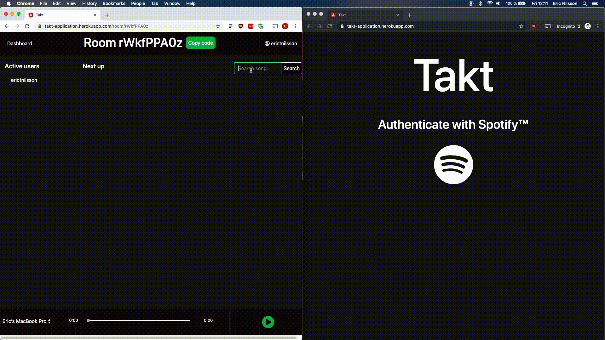

# Takt
 **Takt** is a web app that revolves around virtual rooms where multiple Spotify users can collaboratively create song queues together. Either play the queue from a single device connected to a speaker or tune in with your own and listen (semi) synchronously. The synchronization is not yet 100% promised as 1) the free-tier heroku server is kind of limited in its speed, and 2) there is an inherent potential latency in the Spotify web API.   

# Disclaimer
Takt is still very much a work in progress and thus pretty rough around the edges. It is not deemed production-quality and should be considered more of a proof of concept than anything else. Bugs may still appear. Please use the application at your own discretion.  

# Demo
**Live demo**: [https://takt-application.herokuapp.com/](https://takt-application.herokuapp.com/) (Can be very slow at times)

# User data persistence
User data is not persisted in a database of any kind. It is only stored in HashMaps for as long as the user is logged in.
